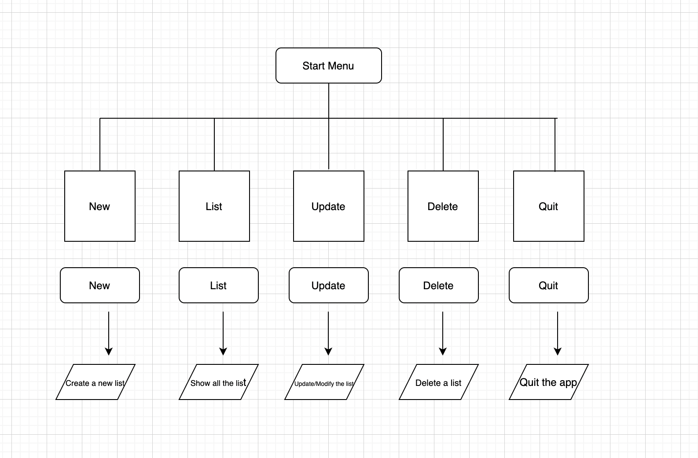

# CRUD Book-Collection

# Problem
- Learning curve to be able to create a terminal app in ruby language.
- To create the data and save it. ( Book Title, rating)
- To be able to Read the data.
- To update the data after reading.
- To delete the data.

- Features include:
1. Use of Variable - To be able to demonstrate on how to use a variable properly without creating errors in the application, assigning variable correctly and using proper syntax and scope. able to use the elements and understand the concept without running into issues and errors.
2. Loop & Conditional control structure. - Able to show and understand loops and conditional control structure without running into an error.
3. error handling - If errors does pop up instead of showing error in the terminal and making the application not work, instead shows an error message.

What is the purpose of the application?
- The application is used for to keep track of Books that the user has been reading.
- To be able to update on books that they been reading. 
- To delete the data that they been reading.
- To show the data that they have stored.

#   Installation
- Simply copy it from github and save into your computer.
- And in your terminal, navigate to the directory.
- type ruby main.rb.

- No system/hardware requirement
- No dependence required by the application to operate.

# Diagram & Plan

# Trello Screenshot Plan

# GITHUB 

https://github.com/ChristopherKhut/TIA3